# 📱 ActivityTracker

> **Serverless activity tracking using AWS Pinpoint for SMS ingestion and Lambda for processing**

ActivityTracker is a modern, serverless application that allows you to track your daily activities by simply sending SMS messages. Built with Python, AWS Lambda, DynamoDB, and a React-based dashboard, it provides a seamless way to log and analyze your activities through text messages.

## 🌟 Features

- **📲 SMS-Based Input**: Track activities by sending simple text messages
- **🤖 Intelligent Parsing**: Advanced NLP parsing of SMS messages to extract activity details
- **📊 Real-time Dashboard**: Beautiful web dashboard to view and analyze your activities
- **☁️ Serverless Architecture**: Built entirely on AWS serverless technologies
- **🔄 Auto-Deployment**: Complete CI/CD pipeline with GitHub Actions
- **📈 Analytics & Insights**: Comprehensive statistics and activity insights
- **🎯 Multi-Environment**: Support for dev, staging, and production deployments
- **🔍 Type-Safe**: Full TypeScript-style typing with Pydantic models
- **✅ Comprehensive Testing**: Extensive test coverage with pytest

## 🏗️ Architecture

```mermaid
graph TB
    SMS[📱 SMS Message] --> Pinpoint[AWS Pinpoint]
    Pinpoint --> Lambda1[SMS Processor Lambda]
    Lambda1 --> DDB[(DynamoDB)]
    
    Dashboard[📊 React Dashboard] --> CF[CloudFront]
    CF --> S3[S3 Static Hosting]
    Dashboard --> API[API Gateway]
    API --> Lambda2[API Lambda]
    Lambda2 --> DDB
    
    GitHub[GitHub Repository] --> Actions[GitHub Actions]
    Actions --> SAM[AWS SAM Deploy]
    SAM --> AWS[AWS Resources]
```



### Components

- **AWS Pinpoint**: Receives inbound SMS messages
- **Lambda Functions**: Process SMS messages and handle API requests
- **DynamoDB**: Stores activity data with GSI for efficient queries
- **API Gateway**: REST API for dashboard and external access  
- **S3 + CloudFront**: Static website hosting for dashboard
- **GitHub Actions**: Automated testing and deployment pipeline

## 🚀 Quick Start

### Prerequisites

- Python 3.11+
- [UV Package Manager](https://github.com/astral-sh/uv)
- AWS CLI configured with appropriate permissions
- AWS SAM CLI
- Node.js 18+ (for dashboard development)

### 1. Clone and Setup

```bash
# Clone the repository
git clone <your-repo-url>
cd ActivityTracker

# Install dependencies with UV
uv sync --dev

# Activate virtual environment  
source .venv/bin/activate
```

### 2. Setup GitHub Deployment (Recommended)

For automated deployment via GitHub Actions:

```bash
# Run the setup script to configure GitHub OIDC authentication
./scripts/setup-github-oidc.sh
```

This creates the AWS IAM role and provides the exact secrets you need to add to GitHub. See the [GitHub Secrets Setup Guide](docs/GITHUB_SECRETS_SETUP.md) for detailed instructions.

**Required GitHub Secrets:**
- `AWS_ROLE_ARN` - IAM role for deployment (from setup script)
- `AWS_REGION` - AWS region (e.g., `us-east-1`)

**Or deploy manually:**

```bash
# Manual deployment to development environment
cd infrastructure
sam build
sam deploy --config-env dev
```

### 3. Configure AWS Pinpoint

After deployment, configure your Pinpoint project:

1. **Get the Pinpoint Application ID** from CloudFormation outputs
2. **Set up SMS Channel** in AWS Pinpoint Console
3. **Request a phone number** for receiving SMS
4. **Configure two-way SMS** to trigger the Lambda function

### 4. Start Tracking!

Send SMS messages to your Pinpoint number:

```
WORK team meeting for 60 minutes in conference room A
```

```
exercise morning jog for 30 minutes at central park  
```

```
MEAL lunch with colleagues for 45 minutes
```

## 📱 SMS Message Format

### Supported Formats

ActivityTracker intelligently parses various SMS message formats:

#### Basic Format
```
[TYPE] [description] [for duration] [at/in location]
```

#### Examples

**Work Activities:**
- `WORK team meeting for 60 minutes`
- `project development for 2 hours in office`
- `coding session at home`

**Exercise Activities:**
- `exercise morning jog for 30 minutes`
- `workout at gym for 90 minutes`
- `yoga session for 1 hour`

**Meal Activities:**
- `MEAL lunch with team`
- `dinner for 45 minutes at restaurant`
- `breakfast cooking at home`

**Study Activities:**
- `STUDY reading documentation for 2 hours`
- `learning new framework`

**Social Activities:**
- `coffee with friends for 1 hour`
- `party at John's place`

**Travel:**
- `commute to office for 30 minutes`
- `flight to NYC for 3 hours`

### Activity Types

| Type | Keywords | Example |
|------|----------|---------|
| `WORK` | work, meeting, office, project, coding | `WORK team standup` |
| `EXERCISE` | exercise, workout, gym, run, walk, yoga | `morning run for 30 min` |
| `MEAL` | meal, lunch, dinner, breakfast, cooking | `lunch at downtown cafe` |
| `STUDY` | study, reading, research, learning | `studying Python for 2 hours` |
| `SOCIAL` | social, friends, family, party, coffee | `drinks with colleagues` |
| `TRAVEL` | travel, drive, commute, flight, trip | `commute for 45 minutes` |
| `OTHER` | anything else | `phone call for 15 minutes` |

## 📊 Dashboard

The web dashboard provides comprehensive activity tracking and analytics:

### Features
- **📋 Activity List**: View all tracked activities with filtering
- **📈 Statistics**: Activity counts, durations, and trends
- **🎯 Insights**: AI-generated insights about your activity patterns
- **📱 Multi-User**: Filter by phone number for multiple users
- **⏰ Time Filtering**: View activities by day, week, month, or custom range
- **📍 Location Tracking**: See where your activities take place

### Accessing the Dashboard

After deployment, find your dashboard URL in the CloudFormation outputs:

```bash
aws cloudformation describe-stacks \
  --stack-name ActivityTracker-dev \
  --query 'Stacks[0].Outputs[?OutputKey==`DashboardURL`].OutputValue' \
  --output text
```

## 🛠️ Development

### Project Structure

```
ActivityTracker/
├── src/activitytracker/           # Python source code
│   ├── models/                    # Pydantic data models
│   ├── services/                  # Business logic services
│   ├── lambdas/                   # Lambda function handlers
│   └── utils/                     # Utility functions
├── tests/                         # Test suite
│   ├── unit/                      # Unit tests
│   ├── integration/               # Integration tests
│   └── conftest.py                # Test configuration
├── infrastructure/                # AWS SAM templates
├── dashboard/                     # React dashboard
├── .github/workflows/             # CI/CD pipelines
└── docs/                          # Documentation
```

### Running Tests

```bash
# Run all tests
pytest

# Run with coverage
pytest --cov=src --cov-report=html

# Run specific test categories
pytest tests/unit/                 # Unit tests only  
pytest tests/integration/          # Integration tests only

# Run tests with verbose output
pytest -v
```

### Code Quality

```bash
# Format code
black src/ tests/

# Lint code  
ruff check src/ tests/

# Type checking
mypy src/
```

### Local Development

For local development of individual components:

```bash
# Install development dependencies
uv sync --dev

# Run a specific service
python -m src.activitytracker.services.sms_parsing_service

# Test SMS parsing
python -c "
from src.activitytracker.services.sms_parsing_service import SMSParsingService
from src.activitytracker.models.sms import SMSMessage

parser = SMSParsingService()
sms = SMSMessage(
    message_id='test',
    phone_number='+1234567890', 
    message_body='WORK meeting for 60 minutes'
)
result = parser.parse_sms_to_activity(sms)
print(result)
"
```

## 🚀 Deployment

### Environments

The project supports multiple deployment environments:

- **dev**: Development environment with relaxed security
- **staging**: Pre-production environment for testing
- **prod**: Production environment with strict security

### GitHub Actions Deployment

The project includes automated deployment via GitHub Actions:

1. **Push to `main`** → Deploys to production
2. **Pull Request** → Deploys to development for testing
3. **Manual Trigger** → Deploy to any environment

### Manual Deployment

```bash
# Deploy to development
sam deploy --config-env dev

# Deploy to staging  
sam deploy --config-env staging

# Deploy to production
sam deploy --config-env prod --no-confirm-changeset
```

### Required AWS Permissions

Your deployment role needs these permissions:

```json
{
  "Version": "2012-10-17",
  "Statement": [
    {
      "Effect": "Allow",
      "Action": [
        "cloudformation:*",
        "lambda:*",
        "dynamodb:*",
        "apigateway:*",
        "s3:*",
        "cloudfront:*",
        "pinpoint:*",
        "iam:*",
        "logs:*"
      ],
      "Resource": "*"
    }
  ]
}
```

## 📋 Configuration

### Environment Variables

| Variable | Description | Default |
|----------|-------------|---------|
| `ACTIVITIES_TABLE` | DynamoDB table name | Set by SAM |
| `ENVIRONMENT` | Deployment environment | `dev` |
| `CORS_ORIGIN` | CORS origin for API | `*` |
| `POWERTOOLS_SERVICE_NAME` | Service name for logging | `activitytracker` |
| `POWERTOOLS_LOG_LEVEL` | Log level | `INFO` |

### SAM Parameters

Configure deployment parameters in `infrastructure/samconfig.toml`:

```toml
[dev.deploy.parameters]
parameter_overrides = [
    "Environment=dev",
    "PinpointProjectName=ActivityTracker-Dev"
]
```

## 🔧 API Reference

### Endpoints

#### `GET /health`
Health check endpoint
```json
{
  "status": "healthy",
  "services": {
    "database": {"status": "healthy"},
    "parser": {"status": "healthy"}
  }
}
```

#### `GET /activities`
List activities with optional filtering
```
Query Parameters:
- phone: Filter by phone number
- limit: Max activities to return (default: 50)
- days: Days back to search
- type: Filter by activity type
```

#### `GET /activities/{id}`
Get specific activity by ID

#### `POST /activities`
Create activity manually
```json
{
  "activity_type": "work",
  "description": "Team meeting",
  "duration_minutes": 60,
  "location": "Conference Room A", 
  "phone_number": "+1234567890"
}
```

#### `GET /stats`
Get activity statistics
```
Query Parameters:
- phone: Filter by phone number
- days: Days for statistics (default: 30)
```

## 📊 Monitoring

### CloudWatch Metrics

The application automatically creates CloudWatch metrics:

- **Lambda Invocations**: Function execution counts
- **DynamoDB Metrics**: Read/write capacity and throttling  
- **API Gateway Metrics**: Request counts and latency
- **Error Rates**: Failed SMS processing and API errors

### Logs

All components use structured logging:

- **SMS Processor**: Logs parsing results and errors
- **API Handler**: Logs request/response and errors
- **Services**: Debug information and performance metrics

### Alerting

Set up CloudWatch Alarms for:

- Lambda function errors
- DynamoDB throttling
- API Gateway 5xx errors
- Long SMS processing times

## 🔒 Security

### Data Protection

- **Encryption at Rest**: DynamoDB tables encrypted with AWS managed keys
- **Encryption in Transit**: All API calls use HTTPS/TLS
- **Phone Number Masking**: Phone numbers masked in logs for privacy

### Access Control

- **IAM Roles**: Least privilege access for all resources
- **API Authentication**: Support for API keys and AWS IAM
- **CORS Policy**: Configurable CORS origins by environment

### Privacy

- **Data Retention**: Configure DynamoDB TTL for automatic data deletion
- **Phone Number Privacy**: Phone numbers hashed in logs
- **Activity Privacy**: No sensitive activity details exposed in errors

## 🚨 Troubleshooting

### Common Issues

#### SMS Messages Not Processing

1. **Check Pinpoint Configuration**:
   ```bash
   aws pinpoint get-sms-channel --application-id YOUR_APP_ID
   ```

2. **Verify Lambda Permissions**:
   ```bash
   aws lambda get-policy --function-name ActivityTracker-SMSProcessor-dev
   ```

3. **Check CloudWatch Logs**:
   ```bash
   aws logs describe-log-groups --log-group-name-prefix /aws/lambda/ActivityTracker
   ```

#### Dashboard Not Loading

1. **Check S3 Bucket Policy**:
   ```bash
   aws s3api get-bucket-policy --bucket YOUR_BUCKET_NAME
   ```

2. **Verify CloudFront Distribution**:
   ```bash
   aws cloudfront list-distributions
   ```

3. **Check API Gateway CORS**:
   ```bash
   curl -X OPTIONS YOUR_API_URL/activities
   ```

#### Database Connection Issues

1. **Verify DynamoDB Table**:
   ```bash
   aws dynamodb describe-table --table-name ActivityTracker-Activities-dev
   ```

2. **Check IAM Permissions**:
   ```bash
   aws iam simulate-principal-policy \
     --policy-source-arn YOUR_LAMBDA_ROLE_ARN \
     --action-names dynamodb:PutItem \
     --resource-arns YOUR_TABLE_ARN
   ```

### Debugging

#### Enable Debug Logging

Set environment variable in Lambda:
```bash
POWERTOOLS_LOG_LEVEL=DEBUG
```

#### Test SMS Parsing Locally

```python
from src.activitytracker.services.sms_parsing_service import SMSParsingService
from src.activitytracker.models.sms import SMSMessage

parser = SMSParsingService()
sms = SMSMessage(
    message_id="debug-001",
    phone_number="+1234567890",
    message_body="YOUR_TEST_MESSAGE"
)

result = parser.parse_sms_to_activity(sms)
print(f"Parsed: {result}")

suggestions = parser.get_parsing_suggestions(sms.message_body)
print(f"Suggestions: {suggestions}")
```

## 🤝 Contributing

### Development Workflow

1. **Fork** the repository
2. **Create** a feature branch: `git checkout -b feature/amazing-feature`
3. **Write tests** for your changes
4. **Ensure** all tests pass: `pytest`
5. **Format** code: `black src/ tests/`
6. **Commit** changes: `git commit -m "Add amazing feature"`
7. **Push** to branch: `git push origin feature/amazing-feature`
8. **Open** a Pull Request

### Code Standards

- **Python**: Follow PEP 8, use Black for formatting
- **Type Hints**: All functions must have type hints
- **Documentation**: All modules and functions need docstrings
- **Tests**: Minimum 80% test coverage required
- **Commits**: Use conventional commit messages

### Testing Requirements

- **Unit Tests**: Test individual functions and classes
- **Integration Tests**: Test component interactions
- **End-to-End Tests**: Test complete user workflows
- **Performance Tests**: Ensure Lambda cold start times

## 📄 License

This project is licensed under the MIT License - see the [LICENSE](LICENSE) file for details.

## 🙏 Acknowledgments

- **AWS**: For providing excellent serverless infrastructure
- **Pydantic**: For robust data validation and serialization
- **pytest**: For comprehensive testing capabilities
- **UV**: For fast Python package management
- **GitHub Actions**: For seamless CI/CD integration

## 📞 Support

If you encounter any issues or have questions:

1. **Check the [Troubleshooting](#🚨-troubleshooting) section**
2. **Search existing [GitHub Issues](../../issues)**  
3. **Create a new [GitHub Issue](../../issues/new)** with:
   - Detailed description of the problem
   - Steps to reproduce
   - Expected vs actual behavior
   - Environment information (Python version, AWS region, etc.)
   - Relevant log snippets (with sensitive data removed)

---

**🤖 Generated with [Claude Code](https://claude.ai/code)**

*ActivityTracker - Making activity tracking as simple as sending a text message!* 📱✨